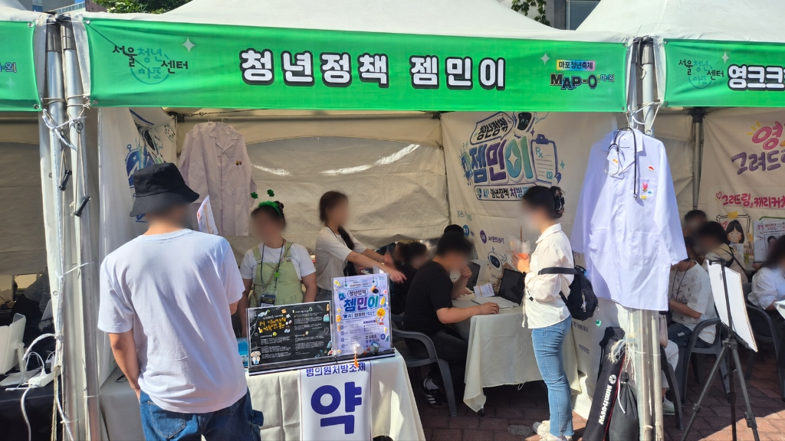
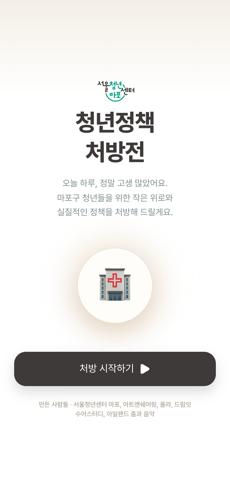
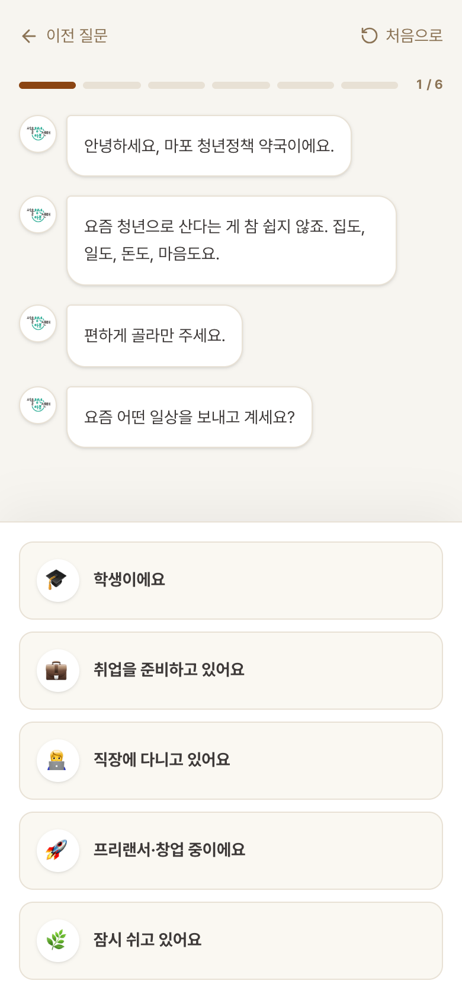
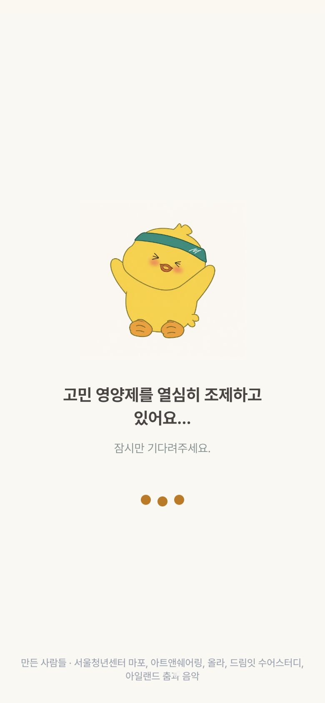
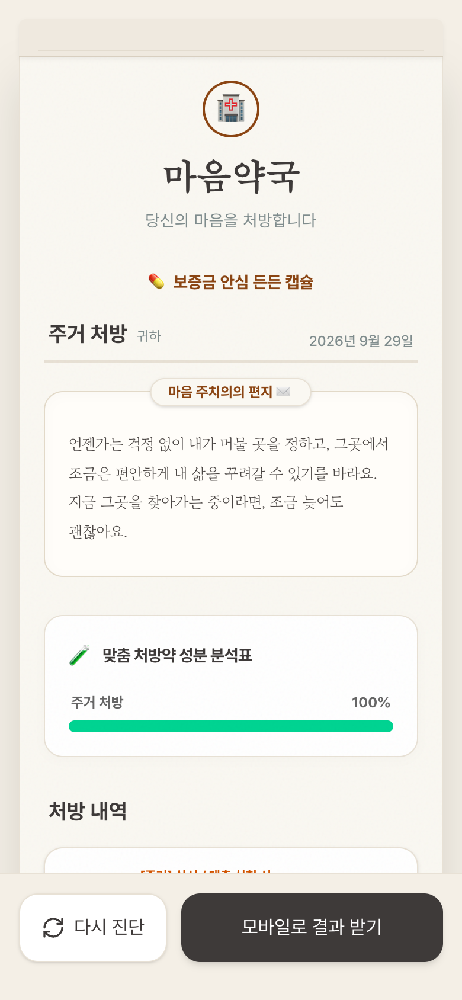

<div align="center">
  

  <h1>💊 청년정책 처방전 (YouthRx)</h1>
  <p><strong>마포청년축제 오프라인 부스(청년정책 젬민이)를 위한 맞춤형 청년정책 처방 웹 애플리케이션</strong></p>
  
  <p>
    
    
    
    
  </p>
</div>

<br />

## 📖 프로젝트 소개

**청년정책 처방전**은 기존의 딱딱하고 찾기 어려운 청년정책을 친근한 **'마음약국'** 콘셉트로 풀어낸 대화형 진단 서비스입니다.
오프라인 마포청년축제 현장에서 **'청년정책 젬민이' 부스**를 운영하며 약 **80여 명**의 청년들이 태블릿(키오스크)을 통해 본 서비스를 이용하고, 자신에게 꼭 맞는 맞춤형 청년정책을 처방받아 모바일로 수령해 갔습니다.

- 🔗 **관련 포스팅:** [서울청년센터 마포 공식 블로그 - 청년정책 젬민이 부스 후기](https://blog.naver.com/prmapo77/224398602939)

<br />

## 📱 앱 화면 미리보기

| 시작 화면 (태블릿) | 질문 화면 (태블릿) | 진단 중 (태블릿) | 결과 처방전 (태블릿/모바일) |
|:---:|:---:|:---:|:---:|
|  |  |  |  |

<br />

## ✨ 기술적 주안점 (Architecture & Technical Highlights)

포트폴리오 및 오프라인 행사 운영을 위해 다음과 같은 기술적 고민을 담았습니다.

### 1. Zero-DB Stateless QR Handoff (DB 없는 모바일 연동)
현장의 태블릿에서 진단한 결과를 개인 휴대폰으로 가져갈 때, **별도의 백엔드 데이터베이스를 구축하지 않고 Stateless 아키텍처를 구현**했습니다. 
사용자의 응답 데이터와 정책 추천 결과를 압축하여 QR 코드의 URL 파라미터로 인코딩(`QR 버전 2`)합니다. 모바일 기기로 QR 스캔 시 클라이언트 단에서 즉각적으로 상태를 복원하고 결과를 렌더링하므로, **서버 부하 제로 및 개인정보(PII) 수집 이슈를 완벽하게 차단**했습니다.

### 2. Kiosk Mode Architecture (오프라인 무인 운영 최적화)
안정적인 부스 운영을 위해 **Idle Guard 패턴**을 도입했습니다. 
- 90초간 터치나 스크롤 등 사용자 인터랙션이 없으면 자동 감지하여 30초 카운트다운 모달을 띄웁니다.
- 응답이 없으면 상태를 초기화하고 메인 화면으로 복귀하여 **다음 참가자를 위한 환경을 자동으로 준비**합니다.

### 3. 정적 타입 기반의 Rule Engine & Test Coverage
수많은 청년정책의 지원 자격(나이, 소득, 주거형태 등)을 매칭하기 위해 브라우저에서 동작하는 **가벼운 룰 엔진(Rule Engine)**을 직접 구현했습니다.
또한 예상치 못한 엣지 케이스를 막기 위해 `npm run check`를 통해 **총 5,120개의 답변 조합**을 자동으로 순회하며 추천 개수, 자격 검증, QR 복원 일치 여부를 검사하는 테스트 자동화 환경을 구축했습니다.

### 4. 부드러운 인터랙션과 Conversational UI
Framer Motion을 활용하여 모바일 메신저처럼 대화가 이어지는 UI를 구현했습니다. `setTimeout`과 애니메이션 딜레이를 정교하게 조율하여, 텍스트가 타이핑되는 효과와 함께 정책 추천을 받는 듯한 **감성적인 몰입감**을 제공합니다. (html-to-image를 활용한 결과 이미지 즉시 다운로드 기능도 포함)

<br />

## 🛠 기술 스택 (Tech Stack)

### Frontend
- **Framework & Library:** React 19, Vite, TypeScript
- **Styling:** Tailwind CSS 4
- **Animation & UI:** Framer Motion, Lottie React, React Confetti
- **Utilities:** React Router DOM, React Use, qrcode.react, html-to-image
- **Code Quality:** oxlint, custom test script (`tsx`)

<br />

## ⚙️ 실행 및 배포 가이드 (Getting Started)

### 로컬 개발 환경
설치된 의존성이 없다면 `npm ci`를 먼저 실행합니다.
```sh
npm ci
npm run dev
```

### 오프라인 행사용 빌드 및 실행
부스 운영 시에는 다음과 같이 정적 파일로 빌드하여 로컬 서버를 띄웁니다.
```sh
npm run build
npm start
```
- 터미널에 표시되는 **Network 주소**(예: `http://192.168.x.x:4173`)를 태블릿 브라우저에 엽니다.
- 기기 간 통신(로컬 네트워크)을 통해 QR 코드가 정상 동작하므로, 태블릿과 휴대폰이 동일한 사설망(Wi-Fi)에 있어야 합니다. 
- (선택 사항) 와이파이망 분리가 불가피할 경우, `.env.local`의 `VITE_RESULT_BASE`에 외부에 배포된 모바일 결과 페이지 URL을 입력한 뒤 빌드하면 퍼블릭 망에서도 QR 결과 확인이 가능합니다.

### 데이터 검증 테스트
```sh
npm run check
npm run lint
```
배포 전, 정책 데이터와 5,120가지 조합의 알고리즘 정합성을 반드시 검증합니다.

<br />

## 📝 정책 데이터 및 면책 조항
본 서비스는 서울시 및 마포구 청년정책(월세 지원, 이사비, 학자금 대출 이자 지원 등)의 주요 조건만을 요약하여 추천합니다.
- 데이터 확인일: 2026-09-07 (종료 모집 구분 포함)
- 본 앱은 실시간 API 연동이 아니며, 행사 전 담당자가 세부 자격 및 공고(예: 서울주거포털, 청년몽땅정보통 등)를 최종 확인해야 합니다.
